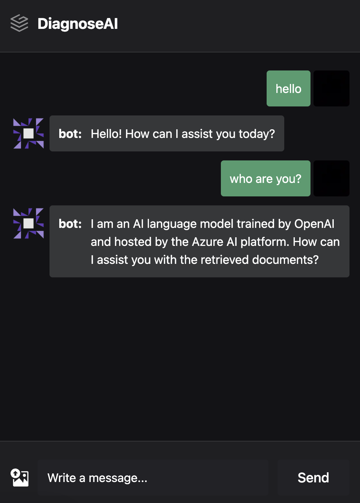

This week marks the start of development, having established the requirements with the client. We focused mainly on building the individual components - UI's and document storage and processing, but also made a start on integration.

# User Interfaces

There was a big emphasis on user interface implementation for week 3. The chat webapp interface was originally designed using React. We then decided that this was unsuitable because of the nature of the project (communication with the chat backend). Hence the webapp was transitioned to Next.js and now offers server-side rendering, and more importanty - secure API calls without exposing keys.

Below is the current version of our uploader interface:

The first design of the uploader was also developed this week from the Figma mock.

# Blob Storage and Cognitive Search

We decided that 2 Blob Storage containers will be used. The first one called "verification" will only have 1 document in it at a time. The document comes from the uploader and all the text will be extracted for verification purposes. The user can view and inquire about this text, and if the document is approved it will be moved to the "production" containter, where all the approved documents are stored.

In order to access our knowledge base we deployed a Cognitive Search model to index of all the aproved documents and query (through vector search). The embeddings model ada-002 is used to generate all the vector representations of the documents so that they can be added to the index.

# Integration
In terms of integration, this week we prioritised two key areas:

1. Chat Integration: connecting the Next.js frontend to our backend through WebSockets. This approach was favoured because of the reliablity and low latency of WebSockets

2. Uploader and Blob Storage: a crucial connection, enabling the smooth transfer of data from our uploader to blob storage. This integration is vital for data processing, forming a core part of our system's architecture.

# CI
In addition to all the frontend and backend development we have set up CI through GitHub Actions on the dev-blog repository.
The workflow activates when changes are pushed to main or a pull request is made. Its purpose is to verify that the blog can be built and deployed correctly.