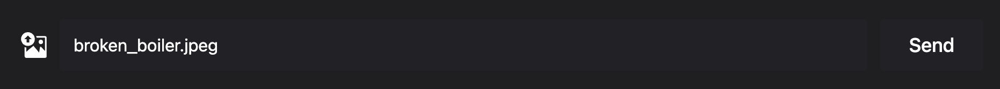
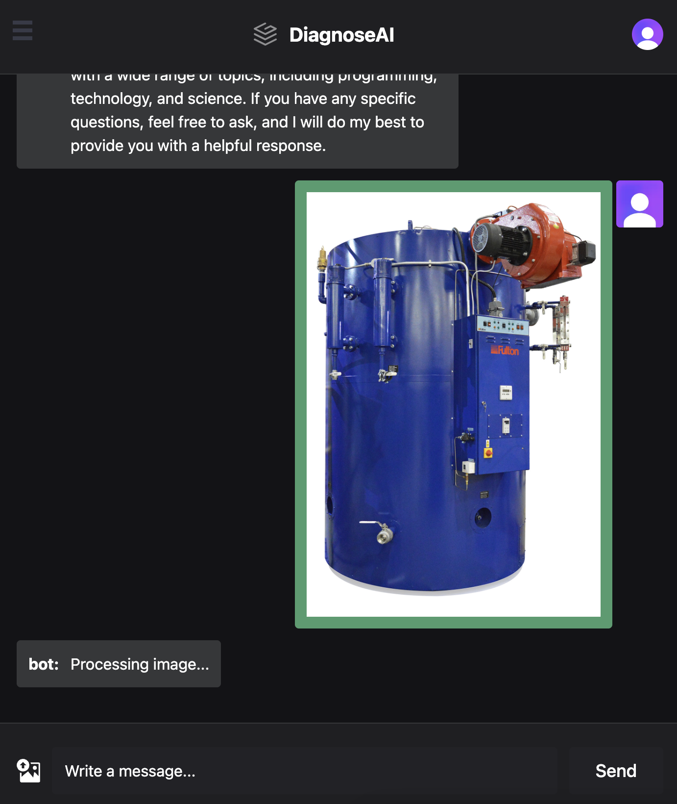

The goal of Week 9 was to progress with the "Must Have" requirements. As more
tasks are being moved to the "Done" section of the Kanban Board, the team
started thinking about deployment. This is something to be done eventually, and
thinking ahead is beneficial in this case as many bugs can arise when it comes
to deployment.

The components addressed this week are webapp and uploader. Both of these are
ready for deployment, which planned for next week.

# Webapp enchancements

As the functionality of the webapp extends and gives the user more options (such
as uploading images), it is important to provide an intuitive UI. We took
inspiration from other chatbot applications such as ChatGPT and Gemini and made
polishes described below:

- ## UI & WebSocket polishes

  The UI changes focus on providing the user with more information about what
  state the app is currently in. To achieve this, webapp now displays a
  placeholder message ("Processing image...") as an image is being processed,
  until genuine text is returned. In addition, if an image is currently selected
  its path will be shown in the input box. These changes can be seen in the
  images below.

  Image path:
  <!--  -->
  
  <!--  -->

  Temporary bot message:

  

  As part of enhancing safety, as well as UX, typing and sending
  messages is disallowed under certain conditions - WebSocket disconnections,
  an image from the user curently being processed, and if an image is
  currently selected for upload. Crucially, whenever the WebSocket disconnects
  the webapp will try to reconnect it automatically. This change ensures that
  the user will not need to manually refresh the page in case of disconnections.

- ## Chat history

  The idea of this enhancement is to allow the user to continue a conversation
  that she has previously started. Before history was implemented, only messages
  sent in the current session would be saved locally; if the page was refreshed,
  then the conversation would be wiped. `ChatContext` now has a
  `fetchHistory(conversationId)` function to fetch the entire context based on
  the conversation belonging to the current user. This will allow users to see
  their previous messages sent in a different session or from a different device

# Uploader enhancements

The uploader changes for this week are less comprehensive, but essential nonetheless.

- ## Deployment Preparations

  Similar to the API key changes from [Week 8](/diagnoseai-dev-blog/posts/week-08/#api-key-security),
  the uploader is now internet ready, it does not expose any keys. Therefore,
  both frontends can now be deployed.

- ## Uploader calls verification

  An important change that was started this week is integrating the call to
  verification inside the uploader. Development started last week and more
  details on the core function can be found on the
  [Week 8](/diagnoseai-dev-blog/posts/week-08/#migrating-validated-documents-to-production-index)
  page. In essence, the Uploader will send an SDK trigger to the relevant Azure
  Function App to cause the selected document to be moved.
